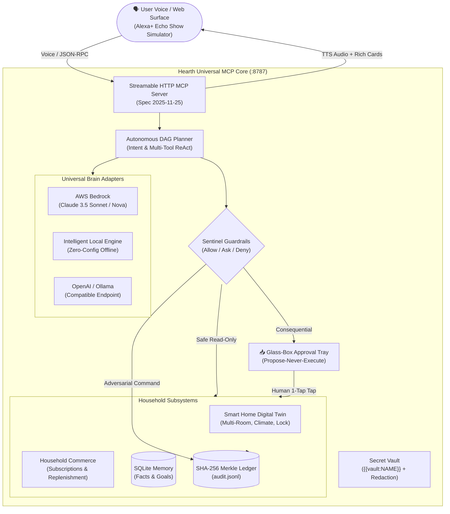

# Hearth Universal 🏠⚡
### The Open Glass-Box Household Operations Agent for Amazon Alexa+
**Built for the "Build, Ship, Shape: Amazon Developer Hackathon" (Devpost 2026)**

[](https://modelcontextprotocol.io)
[](https://modelcontextprotocol.io)
[](LICENSE)
[](tests/)
[](pyproject.toml)

> **Hearth Universal** is an open-source, proactive personal agent for Alexa+ that orchestrates household finances, automated replenishment, and smart home digital twins under an uncompromising **propose-never-execute** safety contract. It works out-of-the-box with an intelligent zero-config offline engine, and natively supports **Amazon Bedrock (Claude 3.5 Sonnet / Amazon Nova)**, OpenAI, or local Ollama.

---

## 🏆 Hackathon Tracks & Challenges

- **Primary Track: Alexa+ ($25,000 Prize)**
  - Self-hosted MCP server implementing **MCP Spec version 2025-11-25** over Streamable HTTP (`/mcp`).
  - Drop-in **Agent Skill package** (`skill/SKILL.md`) with 16 tools, 4 resources, and 3 prompt templates.
  - Multi-modal simulated Alexa+ experience featuring voice recognition, Alexa speech synthesis, interactive ReAct/DAG visualizer, and rich action cards.
- **Mini Challenge: AWS Builder ($5,000 Prize)**
  - Full **Amazon Bedrock Converse API** integration (`src/hearth/brains.py`) supporting Claude 3.5 Sonnet and Amazon Nova.
  - Dockerized runtime for AWS AgentCore / ECS / App Runner (`infra/Dockerfile`).
- **Mini Challenge: Open Source ($5,000 Prize)**
  - Clean, permissive MIT open-source repository with comprehensive documentation, unit tests, and security guardrails.

---

## 🏗️ Architecture



---

## ⚡ 60-Second Quickstart (Zero Configuration Needed)

No external API keys, credit cards, or physical devices required. The project includes an intelligent local agent engine so judges can test immediately.

```bash
# 1. Clone repository
git clone https://github.com/krishivjoshi219-collab/Hearth-Universal.git
cd hearth-universal

# 2. Install dependencies
pip install -e ".[dev]"

# 3. Launch server (starts MCP + REST + Alexa+ Simulator on port 8787)
python mcp-server/server.py
```

Open your browser to:
👉 **`http://localhost:8787`**

### Live MCP Protocol Verification:
```bash
# Handshake with MCP 2025-11-25 Streamable HTTP endpoint
curl -s http://localhost:8787/mcp -H 'Content-Type: application/json' \
 -H 'Accept: application/json, text/event-stream' \
 -d '{"jsonrpc":"2.0","id":1,"method":"initialize","params":{"protocolVersion":"2025-11-25","capabilities":{},"clientInfo":{"name":"curl","version":"1.0"}}}'
```
*Expected response contains `"protocolVersion": "2025-11-25"`.*

### Run Automated Tests:
```bash
pytest -v
```

---

## ☁️ Optional: Live AWS Bedrock & Cloud Brains

To connect to live cloud models, set standard environment variables:

```bash
# Option A: Amazon Bedrock (AWS Builder Challenge)
export AWS_BEDROCK_ENABLED=1
export AWS_REGION=us-east-1
export AWS_ACCESS_KEY_ID=your-key
export AWS_SECRET_ACCESS_KEY=your-secret
export AWS_BEDROCK_MODEL=anthropic.claude-3-5-sonnet-20241022-v2:0

# Option B: OpenAI / OpenRouter / Together
export VAULT_MODEL_KEY=sk-your-key
export HEARTH_BASE_URL=https://api.openai.com/v1
export HEARTH_MODEL=gpt-4o-mini

# Option C: Self-Hosted Ollama
export HEARTH_BASE_URL=http://localhost:11434/v1
export HEARTH_MODEL=llama3
```

### ⚙️ Product operations (no code changes needed)
```bash
cp config.example.yaml config.yaml  # file-based brain/port config (env vars still win)
HEARTH_SCHEDULER=1 python mcp-server/server.py  # background thread advances active goals hourly
```
State is crash-safe (file locks + atomic writes) and survives restarts (`state/`); chat history is capped at 500 turns; `/api/chat` is rate-limited (30/min/IP, `HEARTH_CHAT_RPM`); proposals are single-use with execution receipts.

---

## 🌟 Key Capabilities & Differentiators

| Feature | Obvious Implementation (Chatbot) | Hearth Universal (Agentic Alexa+) |
| :--- | :--- | :--- |
| **Safety Model** | Blindly runs actions or refuses | **Propose-Never-Execute**: Proactive drafts, transparent cost delta, 1-tap human approval tray. |
| **Smart Home** | Text response only | **Full Digital Twin**: Multi-room lighting, HVAC thermostat, smart lock, ambient audio, and energy telemetry. |
| **Subscription Hygiene** | Lists advice in chat | **Automated ROI Audit**: Scans 5 active services, detects dormancy, calculates **$803.76/yr** savings, and drafts cancellations. |
| **Commerce & Replenishment** | "Go buy coffee" | **Pantry Consumable Telemetry**: Tracks bean/laundry levels, locates bundle deals, and stages checkout cards. |
| **Multi-Tool Reasoning** | Single turn Q&A | **Autonomous DAG Orchestrator**: Multi-step parallel dependency graph with live visualizer. |
| **Security & Auditing** | None | **Cryptographic SHA-256 Ledger**: Immutable append-only audit trail verifying every agent and human action. |

---

## 🛠️ MCP Tool Registry (Spec 2025-11-25)

1. `memory_query`: Query persistent household preferences, dietary rules, and budgets.
2. `memory_remember`: Securely persist household facts into SQLite with Vault secret redaction.
3. `goals_create` & `goals_advance`: Manage long-running asynchronous household milestones.
4. `home_get_state`: Inspect multi-room lighting, climate, locks, media, and solar/energy draw.
5. `home_set_scene`: Apply coordinated presets (`evening-calm`, `movie-night`, `away`, `wake`, `energy-saver`). *(Gated)*
6. `home_routine`: Execute multi-step household routines with timers and audio queues. *(Gated)*
7. `home_toggle_lock`: Actuate front door smart lock. *(Gated)*
8. `inbox_scan`: Audit recurring subscriptions and dormant services to recover wasted spend.
9. `commerce_list_inventory`: Monitor consumable pantry levels (coffee, detergent, air filters).
10. `commerce_scan_deals`: Match household essentials with active Subscribe & Save bundle discounts.
11. `actions_propose`: Stage structured action cards in the Approval Tray.
12. `actions_list_proposals`: Retrieve current status of proposed household actions.
13. `actions_decide`: Record human approval or rejection (Human-surface only).
14. `planner_orchestrate`: Decompose high-level goals into multi-tool execution DAGs.
15. `audit_verify`: Cryptographically verify the integrity of the SHA-256 hash chain.

---

## 🔒 Sentinel Safety & Security Matrix

Sentinel enforces a strict 3-tier policy engine:
- **Tier 1 (Autonomous / Allow)**: Reads, lighting, climate, scenes, engaging locks, goals. Executes immediately — comfort should never wait for approval.
- **Tier 2 (Consequential / Ask)**: Moving money, cancelling services, ordering items, or UNLOCKING physical doors. Fail-closed: direct calls return `approval_required` and stage a tray proposal; approval executes once (replay refused, execution receipt stored).
- **Tier 3 (Dangerous / Deny)**: Shell code execution (`rm -rf /`, `mkfs`), raw credential access (`{{vault:...}}`), and unapproved wire transfers are hard-blocked and logged to the cryptographic ledger.

### ✅ Claim map (what's real vs simulated — verify it yourself)
| Claim | Status | Proof |
|---|---|---|
| MCP 2025-11-25 Streamable HTTP, stateless | Real | `curl .../mcp initialize` → `protocolVersion`, or `pytest tests/test_mcp_http.py` (live server, 4 checks) |
| Unlock gating over bare MCP | Real, fail-closed | smoke test asserts `approval_required`, door stays locked |
| Approval executes + single-use | Real | `test_decide_single_use`; receipts in `state/proposals.json` |
| Home persists across restart | Real | kill + restart server, scene/lock intact (`state/home.json`) |
| Bedrock/OpenAI/Ollama brains | Real code path, needs your key/creds | `src/hearth/brains.py`; without creds the local offline engine answers |
| Subscriptions, pantry, home devices | Fixture data (sandbox has no bank/Hue APIs) | `src/hearth/commerce.py`, `home_mock.py` — stated openly, numbers computed not hardcoded |
| Alexa+ on-device rendering | Simulated web UI | visual twin of the MCP loop for judges without devices |

---

## 👥 Hackathon Reviewer Setup (Private GitHub Repos)

If reviewing as part of the official Amazon judging panel, add the following GitHub accounts as collaborators in **Settings > Collaborators > Add people**:
- `chris-trag`
- `knmeiss`
- `giolaq`
- `anishamalde`
- `mosesroth`
- `emersonsklar`

---

## 📜 Documentation Index

- [Product Feedback (Mandatory Hackathon Questions)](docs/product_feedback.md)
- [Friction Logs (10% Bonus Points Submission)](docs/friction_logs.md)
- [AWS Builder Integration Guide](docs/aws_builder_integration.md)
- [Demo Video Storyboard (<3 Minutes)](docs/demo_video_script.md)
- [Devpost Final Submission Text](docs/devpost_submission.md)

---

## 📄 License

Licensed under the **MIT License**. See [LICENSE](LICENSE) for details.
