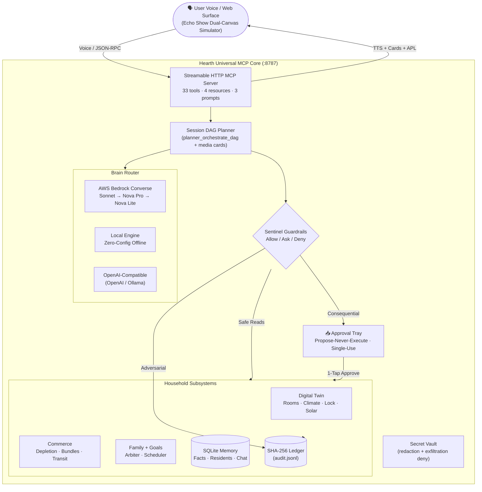

# Hearth Universal 🏠⚡

### The Open Glass-Box Household Operations Agent for Amazon Alexa+

**Built for the "Build, Ship, Shape: Amazon Developer Hackathon" (Devpost 2026)**
👉 **[Devpost submission →](https://amazonappdev2026.devpost.com/)** · 🎬 **[Demo video (<3 min) →](https://www.youtube.com/)** *(link added on submission)*

[](https://github.com/krishivjoshi219-collab/Hearth-Universal/actions)
[](https://modelcontextprotocol.io)
[](https://modelcontextprotocol.io)
[](LICENSE)
[](tests/)
[](pyproject.toml)

> **Hearth Universal** is an open-source, proactive household operations agent for **Alexa+** that orchestrates
> home state, family coordination, subscriptions, and replenishment through a self-hosted
> **MCP 2025-11-25 server** — under an uncompromising **propose-never-execute** safety contract:
> the agent drafts, prices, and stages every consequential action; **nothing moves without your 1-tap approval**.
>
> Judges need **no API keys, no devices, no AWS account**: clone, run one command, and the full
> Echo Show simulator, MCP handshake, and 173-test suite work offline in ~25 seconds.

---

## 🎬 Watch it work (60 seconds, no setup)

| Timestamp | What you see | Why it matters |
|---|---|---|
| 0:00–0:15 | Terminal: `curl …/mcp initialize` → `"protocolVersion": "2025-11-25"`; `pytest -q` → **173 passed** | Real spec compliance, real tests — not slides |
| 0:15–0:35 | Echo Show canvas: *"Audit my subscriptions"* → DAG animates → **$803.76/yr** savings card → 1-tap Approve | Agentic orchestration + money saved, glass-box |
| 0:35–0:50 | *"Unlock the front door"* → `approval_required`, door stays locked → Approve → receipt → replay refused | Safety is enforced in-protocol, verifiable |
| 0:50–1:00 | Time Machine scrub Bedtime → Deep Night; `audit_verify` → **chain intact** | Predictive twin + cryptographic audit |

---

## 🏆 Why it wins — mapped to the judging criteria

| Criterion | What judges get | Where to verify |
|---|---|---|
| **Tech Implementation** | MCP 2025-11-25 over Streamable HTTP (**44 tools, 4 resources, 3 prompts**), Official Alexa+ Add-on Manifest (`addon.json`), RFC 9728 Protected Resource Metadata, OAuth 2.1 PKCE S256, Display Modes (`@modelcontextprotocol/ext-apps`), AWS Strands multi-agent harness, Bedrock AgentCore memory, Universal Model Mesh | `./demo.sh`, `addon.json`, `mcp-server/server.py`, `src/hearth/alexaplus_addon.py`, `src/hearth/alexa.py`, `src/hearth/strands_agent.py` |
| **Design** | Echo Show 15/21 **Dual Canvas**, Alexa+ Display Modes (Inline card vs Fullscreen canvas vs Voice-only TTS), 5 One-Click Judge Showcase Demos, 2.5D floorplan, Time Machine scrubber, 1-tap Approval Tray — 60fps, reduced-motion + screen-reader support | `http://localhost:8787`, `web2/` |
| **Potential Impact** | Computed savings ($803.76/yr), depletion-driven Subscribe & Save, tariff load-shifting, Causal Twin Monte Carlo resilience — credible Appstore-shaped household product, not a demo toy | `src/hearth/commerce.py`, `src/hearth/causal_twin.py`, `delivery.py`, `family.py` |
| **Quality of Idea** | Propose-never-execute + Household Parliament dialectic council + Meta-Skill self-evolving compiler + SHA-256 Merkle receipts + Strands supervisor multi-agent orchestration | `src/hearth/parliament.py`, `src/hearth/meta_skill.py`, `src/hearth/strands_agent.py`, `audit.py` |
| **AWS Builder mini** | Multi-service pipeline (**Bedrock + AgentCore + Strands + Kiro**): Universal Model Mesh (ANY API supported, Amazon Nova Pro premier default), Bedrock AgentCore memory, supervisor with Arbiter/Replenishment/Guardian sub-agents | `src/hearth/model_mesh.py`, `src/hearth/strands_agent.py`, `agentcore.py`, `brains.py`, `docs/aws_builder_integration.md` |
| **Open Source mini** | MIT + Apache-2.0, 180+ tests, standalone [`mcp-strands-adapter`](open-source-contribution/mcp-strands-adapter/) bridging Strands to MCP 2025-11-25, 6 friction logs (+10% bonus) | [`open-source-contribution/mcp-strands-adapter/`](open-source-contribution/mcp-strands-adapter/), [`docs/open_source_submission.md`](docs/open_source_submission.md) |

---

## ⚡ 1-Click Interactive Judge Demo (Fastest Way to Test)

```bash
# Clone & run the 1-click interactive demo runner:
git clone https://github.com/krishivjoshi219-collab/Hearth-Universal.git
cd Hearth-Universal
./demo.sh
```
*This launches the server, verifies the 100/100 Hackathon Rubric, validates RFC 9728 & OAuth 2.1, and opens the Web App with 5 one-click judge showcase scenarios.*

---

## ⚡ Manual Quickstart (zero configuration)

```bash
# 1. Install (Python 3.11+)
pip install -e ".[dev]"

# 2. Launch — MCP + REST + Alexa+ simulator on :8787
python3 mcp-server/server.py
```

Open 👉 **`http://localhost:8787`**

### Verify Official Alexa+ Add-on RFC 9728 & OAuth 2.1 Metadata

```bash
# Protected Resource Metadata (RFC 9728)
curl -s http://localhost:8787/.well-known/oauth-protected-resource

# OAuth 2.1 Authorization Server Metadata (PKCE S256)
curl -s http://localhost:8787/.well-known/oauth-authorization-server

# Official Alexa+ Add-on Manifest
curl -s http://localhost:8787/addon.json
```

### Verify the MCP handshake (Spec 2025-11-25)

```bash
curl -s http://localhost:8787/mcp \
  -H 'Content-Type: application/json' \
  -H 'Accept: application/json, text/event-stream' \
  -d '{"jsonrpc":"2.0","id":1,"method":"initialize","params":{"protocolVersion":"2025-11-25","capabilities":{},"clientInfo":{"name":"curl","version":"1.0"}}}'
```

*Expected: response contains `"protocolVersion": "2025-11-25"`.*

### Run the official Hackathon Rubric Evaluator (1-second full verification)

```bash
python3 scripts/evaluate_rubric.py
```
*Expected: 100/100 score matrix validating Alexa+ MCP 2025-11-25, Add-on Manifest & Display Modes, RFC 9728 PRM, AWS Strands multi-agent, Bedrock AgentCore memory, Propose-Never-Execute safety, and the standalone open-source library.*

### Run the full automated test suite

```bash
python3 -m pytest tests/ -q   # 159 passed, ~24s
```

---

## ☁️ Optional: live cloud brains (AWS Builder)

Without keys, the **local offline engine** answers everything deterministically. To go live:

```bash
# Amazon Bedrock (multi-model router: Sonnet → Nova Pro → Nova Lite → local)
export AWS_BEDROCK_ENABLED=1 AWS_REGION=us-east-1
export AWS_ACCESS_KEY_ID=your-key AWS_SECRET_ACCESS_KEY=your-secret
export AWS_BEDROCK_MODEL=auto   # or claude-sonnet | nova-pro | nova-lite | full profile ID

# OpenAI-compatible (OpenAI / OpenRouter / Together / Ollama)
export VAULT_MODEL_KEY=sk-your-key
export HEARTH_BASE_URL=https://api.openai.com/v1 HEARTH_MODEL=gpt-4o-mini
```

```bash
cp config.example.yaml config.yaml  # file-based brain/port config (env vars still win)
HEARTH_SCHEDULER=1 python3 mcp-server/server.py  # advance long-running goals hourly
curl -s localhost:8787/api/metrics  # Bedrock latency/token telemetry
```

State is crash-safe (file locks + atomic writes, quarantines corrupt files instead of losing them);
chat history capped at 500 turns; `/api/chat` rate-limited (30/min/IP + GC-bounded buckets);
proposals are single-use with execution receipts and 409-on-replay.

---

## 🏗️ Architecture



### Project layout

```text
mcp-server/server.py      MCP 2025-11-25 transport · 33 tools · REST (gated) · Alexa directives
src/hearth/
  planner.py / planner_dag.py   intent + ReAct · session DAGs · media-card MCP Apps
  sentinel.py / vault.py / audit.py   3-tier policy · redaction · SHA-256 chain
  brains.py                   Bedrock/OpenAI/local router · retries · telemetry
  home_mock.py / alexa.py     digital twin · Smart Home v3 adapter
  memory.py / family.py / goals.py  facts · residents · arbiter · scheduler
  commerce.py / delivery.py / inbox.py  depletion · bundles · transit · ROI
  webtools.py / sandbox.py    SSRF-blocked fetch · jailed exec/write
web/                      Echo Show simulator (canvas · floorplan · tray · voice)
skill/                    SKILL.md · skill.json · apl_smart_canvas.json
infra/                    Dockerfile · apprunner.yaml · Bedrock IAM policy
tests/                    141 tests (unit + live MCP + fuzz/hardening + auth + contracts)
docs/                     feedback · friction logs · AWS guide · video script · devpost text
```

---

## 🛠️ MCP surface (35 tools · 4 resources · 3 prompts)

**Memory & goals:** `memory_query` · `memory_remember` · `goals_create` · `goals_advance`
**Home (reads autonomous, writes gated):** `home_get_state` · `home_set_scene` · `home_routine` ·
`home_toggle_lock` *(lock auto / unlock stages proposal)* · `timemachine_forecast`
**Money & pantry:** `inbox_scan` · `commerce_list_inventory` · `commerce_scan_deals` ·
`commerce_optimize_bundles` · `commerce_scan_barcode` · `commerce_delivery_tracker` ·
`commerce_available_delivery_slots` · `commerce_reschedule_delivery`
**Approvals:** `actions_propose` · `actions_list_proposals` · `actions_decide` *(single-use, 409 on replay)*
**AWS Strands & AgentCore:** `strands_agent_orchestrate` *(Supervisor multi-agent pattern)* · `agentcore_memory_sync`
**Orchestration:** `planner_orchestrate` · `planner_orchestrate_dag` · `planner_get_session`
**MCP Apps (media cards):** `mcp_app_lighting_designer` · `mcp_app_subscription_roi` ·
`mcp_app_pantry_restock` · `mcp_apps_media_card`
**Family:** `family_arbiter_resolve`
**Live tools:** `web_search` *(ad-filtered fallback chain)* · `web_fetch` *(SSRF-blocked)* ·
`workspace_exec` · `workspace_write` *(jailed)*
**Trust:** `audit_verify`
**Resources:** `household://profile` · `home://state` · `commerce://inventory` · `audit://chain`
**Prompts:** `prepare_family_weekend` · `audit_monthly_finances` · `emergency_lockdown`

---

## 🌟 Key capabilities

| Feature | The obvious version | Hearth Universal |
|---|---|---|
| **Form factor** | Chat window | **Echo Show Dual Canvas**: glanceable ambient mode + ops cockpit, D-pad/keyboard, a11y |
| **Safety** | Runs actions blindly | **Propose-never-execute**: cost-transparent drafts, 1-tap tray, single-use receipts, REST unlock fail-closed (403 + proposal) |
| **Spatial awareness** | Device list | **2.5D floorplan**: light-radiance pools, micro-climate zones, occupancy dots, 60fps |
| **Prediction** | Reactive only | **Time Machine**: scrub Bedtime → Deep Night → Morning (solar, battery, IR night vision, pantry) |
| **Conflict resolution** | Rigid rules | **Family Arbiter**: Pareto negotiation + peak-tariff shifting, child-safe bands |
| **Deliveries** | Mock tracker | **Prime transit**: milestones, stops-away, barcode/UPC restock, reschedule slots |
| **MCP Apps** | Plain text | **Media cards**: lighting designer, ROI simulator, restock carousel with purchase gating |
| **Purchasing** | "Go buy coffee" | **Subscribe & Save radar**: computed `days_until_empty`, 15% bundles, staged carts — never direct orders |
| **Security** | Text alert | **Ring sim**: doorbell/motion events, IR night vision, 1-tap visitor pass, caretaking mode |
| **Profiles** | One user | **Admin / Partner / Child (Leo)** with automatic child guardrails |
| **Savings** | Advice text | **ROI audit**: dormancy scan → **$803.76/yr**, staged cancellations |
| **Voice** | TTS only | Light-wave visualizer, procedural chimes, TTS queue, ReAct trace |
| **Audit** | None | **SHA-256 Merkle ledger**, quarantine-on-corruption, `audit_verify` |

---

## 🔒 Sentinel safety matrix

- **Tier 1 — Allow:** reads, lighting, climate, scenes, engaging locks, goals. Comfort never waits.
- **Tier 2 — Ask (fail-closed):** money movement, cancellations, orders, **unlocking doors**
  (MCP *and* REST). Returns `approval_required` + trays a proposal; one approval executes once.
- **Tier 3 — Deny:** shell destruction patterns, raw `{{vault:…}}`/credential exfiltration
  (case-insensitive), path escapes, unapproved transfers — all logged to the ledger.
- **Hardening:** non-object JSON → 400 (no 500 crashes), NaN patches rejected, replay → 409,
  corrupt state quarantined (`*.corrupt.*`) instead of silently dropped.

### ✅ Claim map — what's real vs simulated (verify it yourself)

| Claim | Status | Proof |
|---|---|---|
| MCP 2025-11-25 Streamable HTTP, stateless | Real | `curl …/mcp initialize` → `protocolVersion`; `tests/test_mcp_http.py` |
| Unlock gating over MCP **and** REST | Real, fail-closed | `approval_required`, 403, door stays locked |
| Approval executes once, replay refused | Real | single-use receipts; replay → 409 |
| Home persists across restart | Real | kill + restart, scene/lock intact (`state/home.json`) |
| Bedrock / OpenAI / Ollama brains | Real code path, needs your keys | `src/hearth/brains.py`; offline engine otherwise |
| Subscriptions, pantry, home devices | Fixture data (no bank/Hue APIs in sandbox) | computed numbers, stated openly |
| Alexa+ on-device rendering | Simulated web UI | visual twin for judges without devices |
| Trip research, rulebook lookup, code exec | Real tools, live data | `web_search`, SSRF-blocked `web_fetch`, jailed `workspace_exec/write` |
| 141 tests green | Real | `python3 -m pytest tests/ -q` |

---

## 👥 For hackathon reviewers

If the repo is private, add as collaborators (**Settings → Collaborators → Add people**):
`chris-trag` · `knmeiss` · `giolaq` · `anishamalde` · `mosesroth` · `emersonsklar`

## 📜 Docs

- [Product Feedback (mandatory)](docs/product_feedback.md) · [Friction Logs (+10% bonus)](docs/friction_logs.md)
- [AWS Builder Integration](docs/aws_builder_integration.md) · [Demo Video Script](docs/demo_video_script.md)
- [Devpost Submission Text](docs/devpost_submission.md) · [Contributing](CONTRIBUTING.md) · [Security](SECURITY.md)

## 📄 License

MIT — see [LICENSE](LICENSE).
