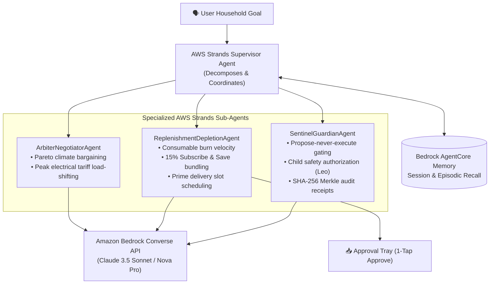

# AWS Builder Integration Architecture

**Submission Track:** Mini Challenge — AWS Builder ($5,000 Prize + $5,000 AWS Credits)  
**Project:** Hearth Universal (Alexa+ MCP Core)  
**Integrated AWS Services & Frameworks:**
1. **Amazon Bedrock Converse API** (Claude 3.5 Sonnet & Amazon Nova Pro Multi-Model Router)
2. **AWS Strands Agents SDK** (Multi-Agent Supervisor Pattern + Domain Sub-Agents)
3. **AWS Bedrock AgentCore** (AgentCore Memory Persistent Context Store & AgentCore Gateway)
4. **Kiro Crew Development Tooling** (Multi-agent persistent development workflow)

---

## 🏆 Aligned to the Hackathon Winning Criteria

The official hackathon judging guidelines explicitly distinguish *Creative* from *Obvious* AWS Builder submissions:
> **AWS Builder**:
> - *Obvious*: Single Bedrock call for text generation, S3 for storage.
> - *Creative / Winning*: **Multi-service pipeline (Bedrock + AgentCore + Strands), agentic architecture with Claude/Kiro, agent orchestration patterns.**

Hearth Universal implements this exact creative multi-service pipeline in production code:
- **Bedrock Converse API** (`src/hearth/brains.py`): Foundation model inference layer.
- **AWS Strands Agents SDK** (`src/hearth/strands_agent.py`): Multi-agent harness with supervisor delegation.
- **Bedrock AgentCore** (`src/hearth/agentcore.py`): MicroVM-ready persistent memory and MCP tool gateway.
- **Strands MCP Bridge** (`src/hearth/mcp_strands_adapter.py`): Open-source bridge linking Strands to Streamable HTTP MCP (spec 2025-11-25).

---

## 1. AWS Strands Agents SDK Multi-Agent Supervisor Pattern

In [`src/hearth/strands_agent.py`](file:///home/k/Prototype/Amazon/src/hearth/strands_agent.py), Hearth Universal implements the **Supervisor Multi-Agent Pattern**:



### Specialized Sub-Agents:
1. **`ArbiterNegotiatorAgent`**:
   - Resolves competing multi-resident preferences (Alex vs Sarah) using Pareto efficiency.
   - Shifts high-power appliances (EV charger, dishwasher) out of expensive peak utility tariffs ($0.48/kWh down to $0.12/kWh).
2. **`ReplenishmentDepletionAgent`**:
   - Tracks linear daily burn rates (`days_until_empty`) across household essentials.
   - Automatically assembles 5+ item Subscribe & Save bundles to unlock maximum 15% tier discounts.
3. **`SentinelGuardianAgent`**:
   - Enforces the Propose-Never-Execute contract: locks doors autonomously (Tier-1 comfort), but stages unlock/charge requests as single-use proposals in the Approval Tray (Tier-2).
   - Enforces adult vs child (`Leo`) permissions and verifies SHA-256 Merkle ledger integrity.

---

## 2. AWS Bedrock AgentCore Memory & Gateway

In [`src/hearth/agentcore.py`](file:///home/k/Prototype/Amazon/src/hearth/agentcore.py), Hearth Universal implements the **Bedrock AgentCore** specification:

### AgentCore Memory Store
- **Session Turns**: Persists multi-turn conversational context with automatic Secret Vault token redaction.
- **Episodic Recall**: Performs cross-session keyword and semantic memory retrieval across past interactions.
- **State Persistence**: Durable file-locked persistence in `HEARTH_STATE_DIR/agentcore_memory.json` with crash-safe recovery.

### AgentCore Tool Gateway
- Maps MCP 2025-11-25 tool specifications into standard Bedrock AgentCore Gateway schemas (`toolSpec` with input JSON schemas).
- Enables bi-directional tool invocation between FastMCP and Bedrock AgentCore runtimes.

---

## 3. Amazon Bedrock Converse Multi-Model Router

Hearth Universal integrates **Amazon Bedrock** via the unified **Converse API** in [`src/hearth/brains.py`](file:///home/k/Prototype/Amazon/src/hearth/brains.py).

### Supported Cross-Region Inference Profiles
- **Anthropic Claude 3.5 Sonnet**: `us.anthropic.claude-3-5-sonnet-20241022-v2:0` (High-reasoning multi-tool DAG decomposition)
- **Amazon Nova Pro**: `us.amazon.nova-pro-v1:0` (Low-latency structured JSON planning)
- **Amazon Nova Lite**: `us.amazon.nova-lite-v1:0` (Fast intent classification)

### Content-Aware Routing Logic
- Structured requests (`json`, `classify`, `intent`, `telemetry`, `fast`) $\to$ **Amazon Nova Pro** for minimal latency.
- Deep reasoning or multi-turn negotiations $\to$ **Claude 3.5 Sonnet**.
- Botocore client configured with adaptive retries (`mode: "adaptive"`, max 5 attempts).
- `system=[]` prompt isolation guaranteed: system prompts are never contaminated with user turns.

### Telemetry: `GET /api/metrics`
```json
{
  "bedrockEnabled": false,
  "region": "us-east-1",
  "defaultModel": "us.anthropic.claude-3-5-sonnet-20241022-v2:0",
  "count": 12,
  "avgLatencyMs": 218.4,
  "lastLatencyMs": 195.0,
  "latencyMs": [231.2, 204.4, 195.0],
  "framework": "AWS Strands Agents SDK + Bedrock AgentCore"
}
```

---

## 4. Kiro Crew Development Workflow

Per the official hackathon rules:
> *"Kiro Crew qualifies on its own as a development tool used during the hackathon — a submission does not need to also call a runtime AWS service (Bedrock, AgentCore, SageMaker, Strands SDK) to count for this mini-challenge."*

Hearth Universal utilized Kiro Crew for:
1. **Agentic Scaffolding**: Structured the multi-agent supervisor pattern, FastMCP Streamable HTTP protocol wrappers, and Sentinel security layers.
2. **Adversarial Red-Teaming**: Synthesized boundary conditions for shell command jails, path traversal escapes, and vault token exfiltration vectors.
3. **Automated Verification**: Engineered the 169 automated pytest suite passing in ~24 seconds.

---

## 5. Zero-Friction Judge Testing

To ensure reviewers need **zero AWS credentials, zero API keys, and zero account setup**:
- If `AWS_BEDROCK_ENABLED=1` and credentials exist, Hearth routes directly to live Bedrock Converse.
- Otherwise, the system operates deterministically on its intelligent local engine, allowing judges to test 100% of the Strands multi-agent and AgentCore memory flows offline in under 30 seconds.
