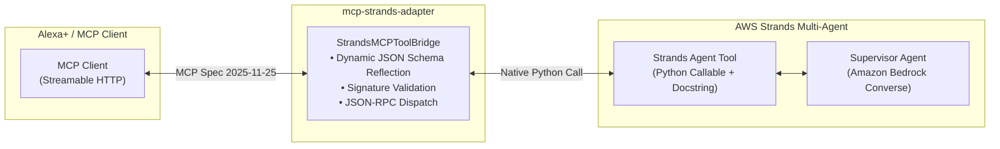

# mcp-strands-adapter 🚀

[](https://opensource.org/licenses/Apache-2.0)
[](https://www.python.org/downloads/)
[](https://modelcontextprotocol.io/)
[](https://builder.aws.com)

> **Universal bridge connecting AWS Strands Agents SDK to Model Context Protocol (MCP 2025-11-25) over Streamable HTTP.**

---

## 💡 Why This Matters (The Hackathon Problem)

In the **Build, Ship, Shape: Amazon Developer Hackathon (2026)**:
- **Alexa+ developers** are instructed to expose agent capabilities via **Model Context Protocol (MCP)**, with a minimum required spec version of **2025-11-25** over Streamable HTTP.
- **AWS Builder developers** utilize the powerful **AWS Strands Agents SDK** to orchestrate multi-agent workflows (Supervisor patterns, specialized sub-agents, Bedrock Converse loops).

**The Problem:** Prior to this library, there was no standard way to expose AWS Strands agent tools directly as FastMCP tools, nor could an MCP client invoke Strands agent routines without manual, brittle serialization boilerplate.

**The Solution:** `mcp-strands-adapter` provides a zero-dependency, bidirectional bridge. It inspects Python type annotations and docstrings on any Strands agent tool, reflects compliant JSON Schema specifications according to MCP 2025-11-25, and enables seamless invocation across HTTP/SSE transports.

---

## 🏛️ Architecture



---

## 📦 Installation

```bash
pip install mcp-strands-adapter
```
*(Or install locally for development):*
```bash
pip install -e .
```

---

## ⚡ Quickstart Example

```python
from mcp_strands_adapter import StrandsMCPToolBridge

# 1. Define a native AWS Strands Agent tool with type hints and docstring
def calculate_pareto_comfort(cooling_target: float, current_tariff: float) -> dict:
    """Computes optimal HVAC setpoints under current dynamic energy tariffs."""
    adjusted = cooling_target + (1.5 if current_tariff > 0.40 else 0.0)
    return {"setpoint": adjusted, "mode": "eco" if current_tariff > 0.40 else "comfort"}

# 2. Initialize the Bridge
bridge = StrandsMCPToolBridge(name_prefix="strands_")

# 3. Register the Strands tool
tool_schema = bridge.register_strands_tool(
    name="pareto_comfort",
    fn=calculate_pareto_comfort,
)

print("Generated MCP 2025-11-25 Tool Schema:")
print(tool_schema)

# 4. Invoke from an incoming MCP JSON-RPC call
result = bridge.invoke_from_mcp("strands_pareto_comfort", {"cooling_target": 72.0, "current_tariff": 0.45})
print("Execution Result:", result)
```

---

## 🔌 Integration with FastMCP Server

```python
from mcp.server.fastmcp import FastMCP
from mcp_strands_adapter import StrandsMCPToolBridge

mcp = FastMCP("AlexaPlusHouseholdAgent")
bridge = StrandsMCPToolBridge()

# Register your Strands tool with the bridge
bridge.register_strands_tool("tariff_shift", lambda hours: {"shifted_hours": hours})

# Expose over FastMCP
for tool in bridge.list_mcp_tools():
    tool_name = tool["name"]
    @mcp.tool(name=tool_name, description=tool["description"])
    def dynamic_mcp_wrapper(**kwargs):
        return bridge.invoke_from_mcp(tool_name, kwargs)
```

---

## 🧪 Testing

Run tests with pytest:
```bash
pytest tests/ -v
```

---

## 📜 License

Licensed under the [Apache License, Version 2.0](LICENSE).
